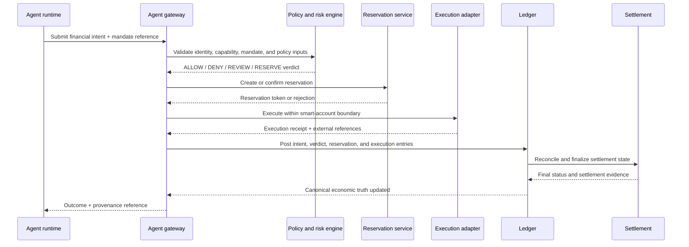
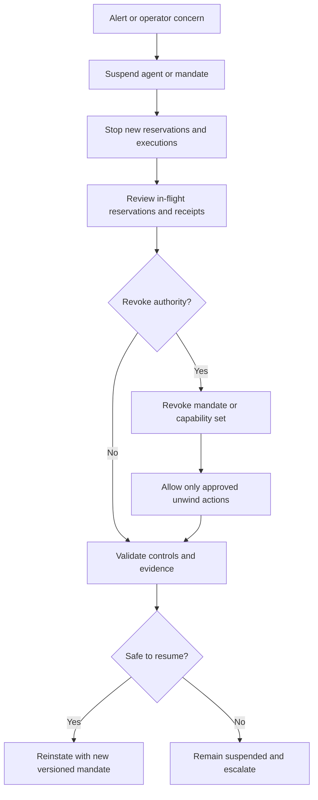
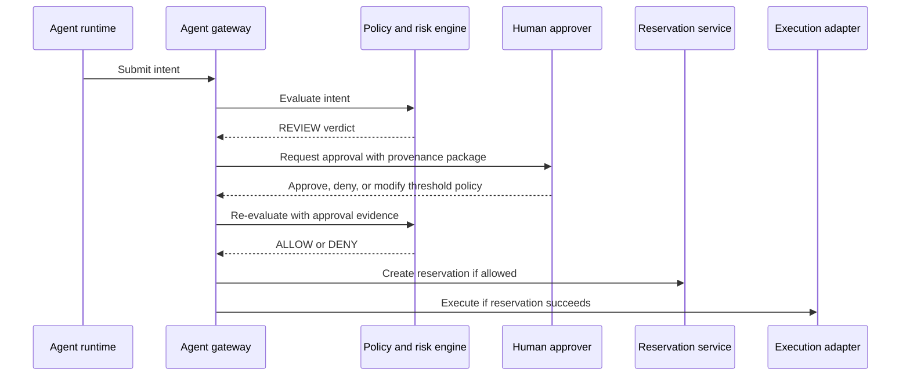

# Authorization pipeline

This document defines the canonical autonomous finance control flow from agent reasoning to final settlement.

## Primary control flow

## Stage narrative

1. **Agent to gateway**: the agent submits a canonical intent, never a direct executable side effect.
2. **Gateway to policy and risk**: the gateway authenticates the agent, loads the versioned mandate, validates capabilities, and runs deterministic policy checks.
3. **Reservation**: available balances, limits, and concurrency-sensitive resources are reserved before execution starts.
4. **Execution**: side effects occur only through approved adapters and smart-account controls.
5. **Ledger**: all accepted attempts are recorded in the ledger, including denied or reviewed outcomes when they affect accountability.
6. **Settlement**: settlement completes the state transition and produces finality evidence.
7. **Provenance**: every stage emits identifiers that chain back to the original intent.

## Control invariants

- No direct AI-to-chain execution.
- No execution without a valid mandate and deterministic policy pass.
- No settlement finality without ledger reconciliation and provenance completeness.
- No silent fallback from confidential to non-confidential execution when confidentiality is required.

## Emergency flows

### Emergency requirements

- Suspension must stop new reservations immediately.
- Revocation must invalidate queued or retryable executions that depend on the revoked authority.
- Kill switches must be reachable outside the active model provider and runtime session.
- Approved unwind authority must be narrower than normal operating authority.

## Human-in-the-loop approval path

### Approval requirements

- Human approval must be captured as provenance, not as an out-of-band message.
- Approval may narrow authority, but it must not broaden authority beyond the active mandate.
- Time-bounded approvals should expire automatically if execution does not begin within the approved window.
